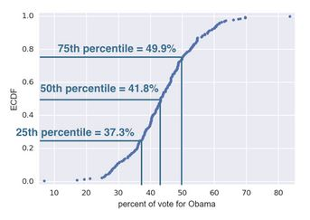
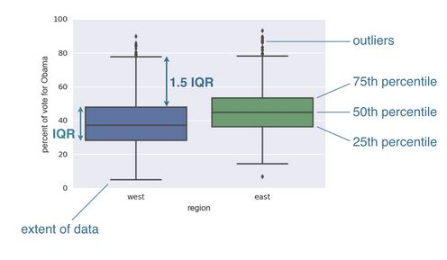

```python

# Statistics in Python

### Histogram
- The default bin size in matplotlib is **10**. 
- The **square root rule** is a commonly-used rule of thumb for choosing number of bins : `choose the number of bins to be the **square root** of the number of samples.`

#### Disadvantages of histogram
- Major drawback of histogram is the same data look different depending on how the bins are chosen, and the choice of bins is in many ways arbitrary.
- This leads to **binning bias.**
- The same data may be interpreted differently depending on choice of bins.
- Additional problem with histograms is we are not plotting all of our data, we are sweeping the data into bins and loosing their actual values.
- TO remedy these problems we can make a `**Bee swarm plot**`

### Plot all of your data : Bee swarm plots
- We dont have a binning bais and whole data is displayed

#### Generating a bee swarm plot

```python
_ = sns.swarmplot(x='state', y='dem_share', data=df_swing)
_ = plt.xlabel('state')
_ = plt.ylabel('percent of vote for obama')
plt.show()
```

### Plot all of the data : ECDFs (Empirical cumulative distribution function)
- Using a bee swarm plot to plot all of the data is not the best option. As an alternative we can compute an **Empirical cumulative distribution function (ECDF)** 
- The x-value of ECDF is the quantity that we are measuring. The yvalue is the fraction of data points that have a value smaller than the corresponfing x-value.

#### Making an ECDF
- The x-axis is the sorted data. We need to generate it using the numpy function sort. The y-axis is evenly spaced data points with a maximum of one, which we can generate using numpy arange function, and dividing by the total no of data points.
- By default, plt.plot plots lines connecting the data  . To plot our ECDF we just want points.

```python
import numpy as np

x = np.sort(df_swing['dem_share'])
y = np.arange(1, len(x)+1) / len(x)
_ = plt.plot(x, y, marker=".", linestyle='none')
_ = plt.xlabel('percent of vote for obama')
_ = plt.ylabel('ECDF')
plt.margins(0.02) # keeps data off plot edges
plt.show()
```

### Percentiles, outliers and box plots

#### Percentiles on ECDF

<p align="center">
  
</p>

- Median is the special name for 50th percentile, that is 50% of the data are less than the median.Similarly, the 25th percentile is the value of the data point that is greater than 25% of the sorted data, and so on for any other percentile we want
- Percentile are used for summary statistics and can be computed using `np.percentile(df_swing['share'], [25,50,75])` . We just pass a list of percentiles we want, and it returns the data that match those percentiles.

##### Box plot

<p align="center">
  
</p>

- The center of the box is the median, which we know is the 50th percentile of the data. The edges of the boxes are the 25th and 75th percentile. The total height of the box contains the middle 50% of the data, and is called the **interquartile range or IQR.**
- The whiskers extends a distance of **1.5 * IQR**, or to the extent of the data, whichever is more extreme. 
- Finally, any points outside of the whiskers are plotted as individual point, which we often demarcrate as **outliers**.
- While there is no single definition for an outlier, being **more than 2 IQRs away from the median is a common criterion**. It is important to understand that an outlier is not necessarily an erroneous data point. Sometimes they are just alternative.
- When the number of data is very large and bee swarm plots are too cluttered, box plots are a great alternative.

##### Generating a box plot using seaborn

```python
import matplotlib.pyplot as plt
import seaborn as sns

_ = sns.boxplot(x='east_west', y='dem_share', data=df_all_states)
_ = plt.xlabel('region')
_ = plt.ylabel('percent of vote for obama')
plt.show()
```

### Covariance and PCC
- A measure of how two quantities vary together. If x and y both tend to be above or both below their respective means together, then the covariance is positive. This means that they are positively correlated. Conversely if x is high while the y is low, the covariance is neagative and the data are negatively correlated.
- However, if we want to have a more generally applicale measure of how two variables depend on each other, we want it to be dimensionless, that is to not have any units. So we can divide the covariance by the standard deviations of the x and y variables. This is called the Pearson correlation coefficient, usually denoted by rho.
- It is the comparison of the variability in the data due to codependence (the covariance) to the variability inherent to each variable independently (their standard deviations). It is dimensionless and ranges from -1 to 1.

### Probabilistic logic and statistical inference
#### Random number generators and hacker statistics
- The basic idea is that instead of repeating the data acquisition over and over again, we can simulate those repeated measurements using Python.
- If we want to simulate a coin flip, we will use the function np.random.random ,which draws a number between 0 and 1 such that all numbers in this interval are equally likely to occur. This type of experiment, where the result is either True(Heads) or False(tails) is referred to as a Bernoulli trial. 

#### Random number seed
- Integer fed into random number generating algorithm. Manually seed random number generator if we need reproducibility. Specied using `np.random.seed()`
- The same seed gives the same sequence of random numbers.So if we want to have a reproducible code, its a good idea to seed the random number generator using the np.random.seed function.

#### Simulating 4 coin flips

```python
import numpy as np
np.random.seed(42)
random_numbers = np.random.random(size=4)
heads = random_numbers < 0.5
np.sum(heads)
```

- We want to know the probability of getting four heads if we were to repeat the four flips over and over again.

```python
n_all_heads = 0 # initialize number of 4-heads trails

for _ in range(10000):
    heads = np.random.random(size=4) < 0.5
    n_heads = np.sum(heads)
    if n_heads == 4:
        n_all_heads += 1
n_all_heads / 10000    # result is no of times we got all heads, divided by the total no of trails we did
```


```
