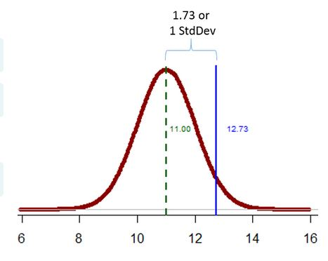
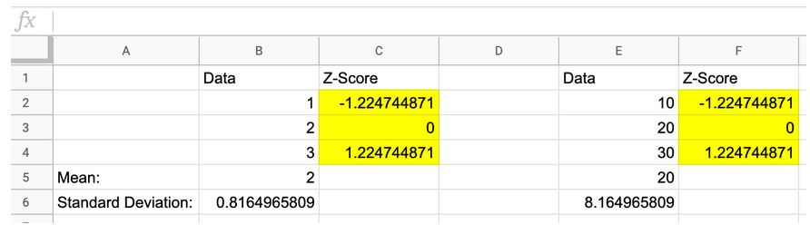
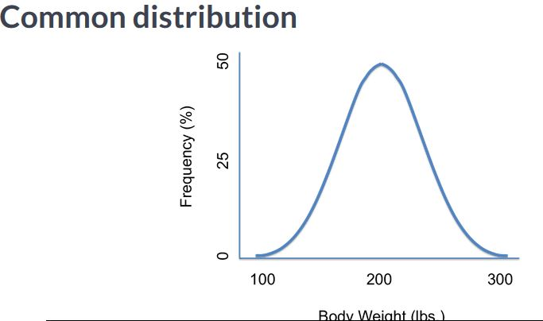
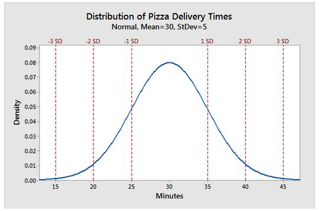
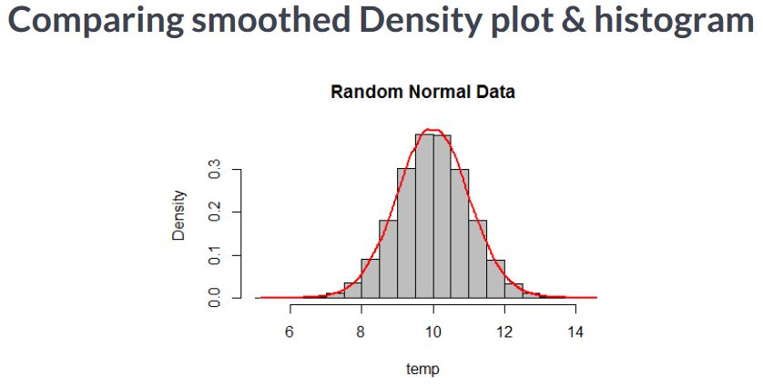
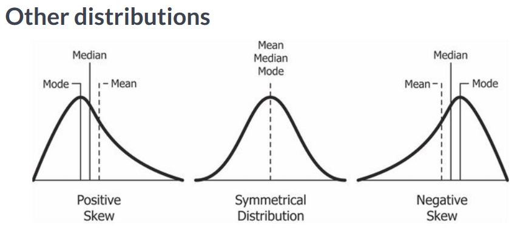
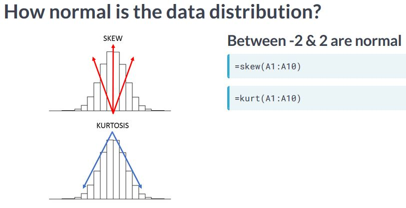

# Statistics in Spreadsheets

#### Statistics is just a piece of information from large quantity of data. It describes data.

- Mode : A number that appears most often in the dataset.
- We can the mean using the **`=AVERAGE(B2:B11)`** function.
- **`=MEDIAN(B2:B11)`** to calculate the median.
- **`=MODE(B2:B11)`** to calculate mode.

### Data point distance from average
- *Variance* : Variance measures how dispersed a dataset is from its mean. The smaller the variance the less spread the data is. Conversely, large differences between data points increase the variance.
- A : 37,37,37 | B : 10, 14, 10, 10 | C : 10, 14, 100, 10
- Column A variance : 0, Column B : 3 , Column C : 1476.75
- Column C has an outlier as a result its variance is maximum.
- **`=VARP(A1:A14)`** to calculate variance.
- Variance is the average of squared values. Thus variance is different from the original sample values making it less intutive.
- **Most often we need to make sense of the variation by putting it in the scale of the original data.** `This is done by taking the square root of the variance, called standard deviation`
- After taking the variance with **`VARP`** we can use **`SQRT`**, squareroot to calculate the **standard deviation**
- More easy we can use **`STDEVP`** to get standard deviation

#### Standard deviation as a unit of measure
- Std dev scores shows how a data point relates to the distribution.
- =average(10, 14, 10, 10) = 11 | =stdevp(10, 14, 10, 10) = 1.73 | new data point : 12.73
- Subtracting new data point from standard dev gives back the mean | 12.73 - 1.73 = 11
- **Thus this new data point is exactly one standard deviation away from the mean**

  

#### Another statistic for understanding a distribution is percentile 
- Ordering a distribution & calculating the percentage of values below a specific point will tell us its **percentile**
- **Quartiles** are percentiles that segment the data into 4 chunks.
- To get the popular percentiles in sheets we use the **=QUARTILE(b1:b5, 1)**

- Calculating standard deviations
There is a lot of seasonal variability in the train data. To better understand this, we will calculate the standard deviation to understand how "spread out" the data is from the mean average.

To calculate the standard deviation:
Calculate the variance of the data.
Take the SQRT(), or square root, of the variance.

- The QUARTILE() function accepts an array of values followed by an integer 1 to 4 to declare the specific quartile.
Quartile 4: The maximum value in the data.
Quartile 3: 75% of the data is less than the third quartile.
Quartile 2: The median of the data.
Quartile 1: The smallest values 25% of the data.

- A useful statistic computed from the quartiles is the "interquartile range" (IQR), which lies between the Q1 and Q3 and represents the middle 50% of the data.

### Standardizing Data
- Many real world datasets have variables that are measured on different scales. For e.g, height might me measured in feet and weight might be measured in pounds. This poses a problem because variables on different scales are harder to compare, and it may lead to misinterpretation of the importance of a particular column - that column may appear more important simply because it has larger values than another, while in reality it may actually have a very similar distribution to the column with smaller values.
- **The solution to this problem is to standardize the data so that all the variables are on the same scale**
- In statistics, standardization centers a dataset's distribution around the mean of the data and calculates the number of std devs away from the mean each point is.
- We can standardize our data by calculating **z-scores**, also known as standard scores.
- **The z-score measures how far a value is from the mean using standard deviations.**
- TO calculate the z-score of a data pt, subtract the mean and divide by the std-dev
- **=STANDARDIZE(DATA POINT, MEAN, STD-DEV)** to calculate z-score

  

- As we can see, the new data points despite being 10 times larger, the distance of each data point to their respective sample's mean & std-dev are the same as in the first column, and this allows us to easily compare the two columns.

### Visualizing Distributions

  

- A lot of the things we measure in the world looks something like above.

  

- Above distribution is of pizza delivery times.
- In both cases, the highest point is in the middle of the distribution, or the most frequent value is the highest point.
- The resulting shape is similar to a bell so this distribution is often called a **bell curve**. It is technically called the **normal distribution**.

  

- Conceptually, a normal distribution is symmetrical and shaped like a bell.
- In normal distributions ,the mean, median and modes have similar values. As a result, not only is the distribution centered at the mean, median and mode but the frequencies of these values decrease symmetrically so other summary stats are affected like quartiles and std -devs.

  

- There are many distribution shapes, some of the common ones are shown above. For each, the summary statistics will change. For e.g the mean is affected by outliers, or extreme values in the data, however the median is not.
- So in a `skewed distribution` these values will differ **unlike the normal or symmetrical distribution where mean and median are very close.**
- Often in stats we want to test how "normal" the data is. Even though we can see a bell curve shape, there are two mathematical aspects to a normal distribution. 

  

- First, how much does the data lean or skew from the most frequent value. In the visual its shown with the red arrows. A normal distribution will have little to now skew, represented by the vertical red line.
- Second, to measure symmetry and how the tails trail off, we review the blue lines.
- These aspects, leaning and trailing off are measured in **skew** and **kurtosis**.
- In sheets we use **=skew(a1:a10)** and **kurt(a1:a10)** , to get leaning and trailing off statistics. 
- There are many opinions on acceptable values for skew and kurtosis to describe a normal distribution. Typically, values between **-2 & 2 for both skew and kurtosis** can indicate a **normal distribution**
- To add histogram in sheets : Go to insert -> then chart -> select histogram from chart type drop down and finally declare the data range.

#### Is the data "normally" distributed?
- Earlier, we noted that the mean and median savings values were almost equal. The savings histogram was also roughly symmetrical and resembled a bell curve.
- Now we want to use statistics to verify if the distribution is approximately symmetrical or "normally distributed". To do so, we will calculate the skew and kurtosis.
- **Kurtosis**: Calculated using `KURT()`. Measures how the tails behave. It identifies how values are concentrated around the mean and how they trail away from it in the tails.
- **Skew**: Calculated using `SKEW()`. Measures how symmetrical the distribution is. 0 means the distribution is exactly symmetrical. Values above or below 0 indicate that there are more values above or below the mean.

### Visualizing Correlations
- We will transition from histogram which visualizes a single variables to a scatter plot which explores relationship among two variables.
- In  sheets we can add a imaginary line passing through our scattered data points. Its called a trend line to help see the overall trend relationship.
- To add a trendline in sheet : click "insert" then "chart" then select "scatter chart" from the drop down , then click customize in the dialog and under "series" check the "trendline" box.
- The trend line is added or fit so that the distance between the line and each point is minimized.

#### Stats about the trendline
- In sheets we can get the slope and intercept of the trend line using the **=LINEST(rangeX, rangeY)** or line estimate function. It accepts two ranges and will return the slope then the intercept.
- The slope can be interesting because it declares the trend relationship between the variables. For e.g a slope of 1.5 means that as the X varaible increases 1 then the Y varaible will increase by 1.5. IF the slope is -1, then if the slope variable decreases by 1 then so does the Y variable.
- correlation can be calculated using **CORREL()**, ranges between -1 and 1. 
- 0 correlation means there is no relationship between variables.
- Positive correlation indicate that as one variable increases, the other also increases.
- Negative correlation values signify that as one variable increases, the other decreases.

### Central Limit Theorem in action
- increasing the sample size changes both the statistics as well as the histogram
- **CLT** : If a sample size from an independent, random variable is large enough, then the sampling distribution will be normal or nearly normal.

#### "Large enough" is vague. The sample size is impacted by:
- How accurate we need to be. Since a sample is a representation, the resulting stats will be approximate. If we need a high degree of certainty, we will need more samples to more closely resemble the population.
- The more closely the population follows a normal distribution, the fewer sample points will be required.

### Hypothesis Testing
- **Hypothesis** : Is any testable claim
- Stating that the price of a Ferrari is high, isnt testable.This is because high isnt defined. To make it testable we can define the hypothesis such as `average Ferrari price is higher than the average sports car price.`
- There are two types of hypothesis the **NULL** and **alternate**.
- **Null hypothesis** : represents the status quo or the accepted fact. The NULL is short for NULLIFY. This is because our statistical test seeks to NULLify or reject, the statement. 
- **Alternate/Research Hypothesis** : is the challenger statement meaning everything else not represented in the NULL hypothesis.
- Generally an **H0** denote the NULL while **H1** represent the alternate.
- In our example the **NULL** is that the **`average Ferrari price is equal to the average sports car price`** . The **Alternate/Challenger** hypothesis is that the **`average ferrari price is greater or less than the average sports car price.`**
- The status quo is that there is no difference but we want to test if there is a difference.

#### Common sense testing
- **NULL Hypothesis (H0):**  `Average Ferrari Price equals Average Sports car Price`

- **Alternate Hypothesis (H1):** `Average Ferrari price does not equal Average sports car price`

- Average Ferrari Price(Sample size = 50) = $252,000
- Average non-Ferrari Sports Car Price(Sample Size = 50) = $85,000

- There is a large difference in the average prices, so we dont agree with the status quo. In stats quo, we REJECT the NULL hypothesis.

#### Another common sense test
- **NULL Hypothesis (H0) :** `Average toyota price equals average honda price`
- **Alternate Hypothesis (H1):** `Average toyota price does not equal average honda price`

- Average Toyota Price (sample size = 50) = $23,845
- Average Honda Price (sample size=50) = $23,720

- The values are so close, so the difference may only be from sampling. So we accept the NULL Hypothesis. In stats we say `Fail to reject the NULL Hypothesis`.

#### Removing subjectivity in a test
- To further avoid subjectivity, hypothesis testing uses a **test statistics** to measure the H0 validity.
- The car price experiment tests the independence of two samples. So we use a **t-test** as the statistic. Example : t-test (In spreadsheets : T.TEST(range1, range2, tails, type))
- The t-Test produces a p-value. **p-value** is the probability that the results are due to chance/error.
- We have to predetermine a p-value cutoff for our test. Choose a p-value cutoff (Example: 1%/0.01, or 5%/0.05). This means we want to have a probabilty of say 1% or 5% that the results are an error.
- We use a p-value of 5% in most cases.
- If the p-value(probability) is less than the cutoff, 5% then we will **REJECT the NULL Hypothesis** and conclude that there is a difference between the samples.
- **If the p-value from our test statistic is less than 0.05 then we reject the NULL hypothesis**

- **Spreadsheet Formula** : **`=T.TEST(range1, range2, tails, type)`** - It accepts range1, range2, the number of tails being tested & type of test.
- If we are testing whether the `difference is only greater than or only less than the t-test has 1 tail.`
- In our case, the H0 operator is equals. So values can be above or below the mean. Thus the test has `two tails` in either direction from mean. 
- Next if we measure the `same observations at different times, the type equals 1.` If we measure `different observations with the same variance the type is 2` and i`f we measure different observations with different varainces, then use type 3`

### Comparing samples with a t-test
- How can we be sure if a sample is the same or different compared to a population or other sample? **Sample independence can be tested with a T.TEST()!**
- examining data from a farm. Prior to introducing a new fertilizer, 10 plant heights were measured. After the new fertilizer was used another 10 plants were measured. We will perform a t-test to understand if the plant heights in the samples are in fact different. `This is a two-tailed test because the heights are either above or below the original sample, "tails" to either side of the original distribution.The type is 2 because the samples are not from the same subjects but they have the same variance.` Had they been the same plants before and after fertilizer treatment, it would be a "paired" t-test which is type 1. 
- `NULL Hypothesis` : `Prior plants height equals next plants height`.
- `Alternate Hypothesis` : `Prior plants height does not equal next plant height`.
- Refer excel [t-test](excels/t-test.xlsx)

### Paired t-test
- Now we are looking at driver data. Most research suggests drivers perform better in the morning versus in the afternoon. The researcher here measured 10 drivers in the morning and again the same drivers in the evening. The milliseconds response time is the time needed to apply the brakes after seeing a prompt in the simulator. We need to perform a t-test to see if this data supports the research that drivers do indeed perform better in the morning.
- `NULL Hypothesis (H0)` : Morning driver response times  <  Afternoon driver response times
- `Alternate Hypothesis (H1)` : Morning driver response times  >=  Afternoon driver response times
- `Tails` : This should have `one tails` as we are testing whether difference is greater than or equal only.
- `Type` : `Type equals 1` as same drivers are measured at different times.
- Refer excel [t-test_2](excels/t-test_2.xlsx)

### Hypothesis testing with the Z-test
- The t-test infers whether there is a difference between two mean averages. Similarly a Z-test will give us a probability that two dataset averages are different. 

#### Comparing the T-tests and Z-tests
##### Similarities
- Determine  whether two population means are statistically different
- Select a p-value cutoff prior to the test (Usually 0.05)
- If the resulting p-value is less than 0.05, then REJECT H0 else FAIL TO REJECT H0.

#### Contrasting T-tests and Z-tests
##### Even though both t-tests and Z-tests work with sample averages there are some differences
- Z-Test Formula **`Z.TEST(rnge1, testStatisctic, Stdev)`**
- T-Test Formula **`T.TEST(range1, range2, tails, type)`**
- A T-test needs 2 ranges in the formula incontrast Z-test needs only one.
- Instead of worrying about tails and types like in a t-test, a z-test accepts a known summary statistic from the population.
- Z-test needs a test statistic(i.e population mean). T-test works when variance is unknown.
- Z-test is used with bigger datasets (n > 30) whereas T-test is used with smaller datasets (n < 30).
- Just like how the z score measured how many standard deviations a value was from the mean. A Z-test is similar and measures a distance. 

#### Z-tests calculates the probability
- Instead of z-score we will be calculating a z-test statistic. The result of a z-test is a probability not a distance like z-score.

#### Z-Tests in Spreadsheets
- **`Z.TEST(data, value, [standard_deviation])`**
- Data array, next add the value called "test statistics", std deviation. Reject the NULL hypothesis if the p-value is less than 0.05.

### Performing a Z-test
- When we have over 30 observations, we should use a Z.TEST() over a T.TEST() to compare means. Excel [z-test_2](excels/Z-test.xlsx) has some salary data of U.S Government workers. Our job is to conduct a hypothesis test using the Z-test. 
- Here we want to know if the sample average salary is less than or equal to the government's published average. Are we going to compare one or two tails of the distribution? The <= operator is exploring a single direction away from the value. Thus, this is a one-tailed test.
- A Z-test accepts the data range followed by the population's mean - in this case, the government's published average salary. We can also add the population's standard deviation as a third parameter. If we don't, Z.TEST() will use the sample's standard deviation.

### What changes in a two-tailed test?
-  Now we want to determine if the sample worker salary is equal to the population's. The NULL hypothesis operator changes to = .
This means we are testing whether the sample average is statistically above or below the average. As a result, the experiement is testing in 2 directions from the mean, so it's a two-tailed test.
- If we have a two-tailed test we must multiple the Z.TEST() results by 2. 
- Refer excel [z-test-2-tailed](excels/Z-test-2-tailed.xlsx)

### Hypothesis testing with Chi-squared test

#### Applications of the chi-squared test
- When we are doing research we often have a set of prior observations and after some treatment like applying a new drug we need to know if the treatment actually made a difference. This is determined with the chi-squared test.
- Comparing samples for meaningful differences.

#### Testing before and after 
When we have prior observations and new sample we are left with two choices. Two possibilities :
- The difference in the new group stems from random sampling (H0)
- There is in fact a meaningful difference (H1)
- These two choices are used for the NULL and alternate hypothesis. Further the chi-square test will provide a probability that the two groups are independent or truly different.

#### Chi-sqaured test conditions
- For a chi-squared test to be useful data has to be in groups such as (e.g "old treatement", "new treatment") or values based on gender or other dividing data characteristic.
- Avoids really small expected values (<5). The general consensus is that the expected numbers we are measuring should be greater than 5. Otherwise we may need to perform different tests.

#### Testing the independence of two groups
- Often we see in advs "Clinically proven" or "Lab tested". Inorder to make claims about how the drug improves outcomes ethically and legally the owners need to create an experiment controlling for lifestyle factors and ultimately comparing weight within two groups one treated with the supplement and the other not.
- **Its in the lab or clinic that a chi-squared test is often performed to test the independence of the two groups.**

#### Chi-squared test in Spreadsheets
`CHITEST(observed_range, expected_range)`
- FAIL TO REJECT H0 if the p-value is greater than 0.05
- REJECT H0 if the p-value is less than 0.5

#### Performing a chi-squared test
- In science and other disciplines, it's important to know if the variation we observe in our data is due to chance or is actually stemming from another source.One way to understand this is with a chi-squared test.
- CHITEST() function accepts two ranges. The first represents the observations, and the second represents the expected values.In this case, both ranges must have the same COUNT() or the formula will fail. The formula returns the p-value we will use to determine whether or not to reject the null hypothesis.
- In this example we are reviewing a call center agent's call times. The agent has a higher average call time than the expected call time for all other agents. Let's see if this agent's specific call times are due to chance, i.e. random call variation, or because the agent needs more training to speed up. 

- To perform chi squared test in sheets, use the CHITEST function.

- 

